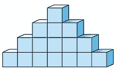

```{.python .input  n=1}
%%javascript
IPython.Cell.options_default.cm_config.lineNumbers = true;
```

```{.json .output n=1}
[
 {
  "data": {
   "application/javascript": "IPython.Cell.options_default.cm_config.lineNumbers = true;",
   "text/plain": "<IPython.core.display.Javascript object>"
  },
  "metadata": {},
  "output_type": "display_data"
 }
]
```

```{.python .input  n=2}
# Charge ma feuille de style pour nbviewer
from IPython.core.display import HTML
import urllib.request, urllib.parse, urllib.error
import sys
url='https://github.com/debimax/cours-debimax/raw/master/documents/custom.css'
import urllib.request
with urllib.request.urlopen(url) as response:
    styles = response.read().decode("utf8")
styles="<style>\n{}\n</style>".format(styles)
HTML(styles)
```

```{.json .output n=2}
[
 {
  "data": {
   "text/html": "<style>\n\n\ndiv.text_cell_render { font-size: 12pt;   line-height: 145%; }\ndiv.text_cell_render h1{text-align: center;font-size: 24pt; color:#ff0000;  text-decoration: underline;}\ndiv.text_cell_render h2{font-size: 20pt;color:#ff0000;  text-decoration: underline;}\ndiv.text_cell_render h3{font-size: 14pt;color:#ff0000;  text-decoration: underline;}\ndiv.text_cell_render h4{font-size: 12pt;color:#ff0000;  text-decoration: underline; }\ndiv.text_cell_render h5 {font-weight: 300;}\n\n\ndiv.cell.code_cell { /* area that contains code + output */\n    background: #ffffff;\n    border: none;\n    border-radius: 10px;\n    padding-top: 1ex;\n}\n\ndiv.input_area { /* box around box with code */\n    border: none;\n    background: #f5f5f5;\n    border: 1px solid #ccc;\n    border-radius: 10px;\n    padding-top: 0.5ex;\n    padding-bottom: 0.5ex;\n    padding-left: 0.5em;\n}\n\ndiv.input { /* box with code */\n}\n\ndiv.CodeMirror { /* code font */\n    font-family: \"Inconsolata-dz\", monospace;\n    font-size: 10pt;\n}\n\n\n\n\n\n/*div.text_cell_render  code { font-size: medium; border: 3px #ababab solid; background-color: #f5f5f5;}*/\n/*.rendered_html code { border: 3px #ababab solid; background-color:  #f5f5f5;}*/\n.rendered_html blockquote { margin: 1em 2em; background: red; }\n.rendered_html ol { list-style:decimal; margin: 1em 2em; }\n\n\n</style>",
   "text/plain": "<IPython.core.display.HTML object>"
  },
  "execution_count": 2,
  "metadata": {},
  "output_type": "execute_result"
 }
]
```

# I Les bases de python3

## 1) Hello World
On ne va pas y échapper, quand on apprend un langage, le premier programme
étudié est le programme qui affiche "Hello World!".
On utilisera ipython qui est shell python amélioré.

```{.python .input}
print("Hello World !")
```

C'est relativement simple.

Remarquez au passage l'absence de point-virgule en fin de ligne, contrairement
au C, à Java et à bon nombre de langages.

## 2 Le syntaxe générale

### a) indentation

Python oblige donc le développeur à structurer son code a l'aide des
***indentations*** : ce sont elles qui détermineront les blocs (séquences
d'instructions liées) et non les accolades comme dans la majorité des langages.

### b) Commentaires
Le caractère **\#** permet d'indiquer que tous les caractères suivants sur la
même ligne ne doivent pas être interprétés. il s'agit de commentaires

###  c) Variables

Python utilise le symbole ***=*** pour affecter une valeur à une variable.
par exemple:

```{.python .input}
a=2
```

```{.python .input}
a==12
```

Attention: a=12 place la valeur 12 dans la variable a mais a==12 vérifie si la
variable a est égale à 12, c'est donc un boléen. (***True*** ici car a est bien
égal à 12).


```{.python .input}
a=2
```

```{.python .input}
a
```

```{.python .input}
a+=3
```

```{.python .input}
a
```

Les opérateurs d'incrémentation ou de décrémentation ++ ou - n'existent pas en
Python.
Par contre, vous avez la possibilité d'effectuer des affectations de variables
multiples avec une même
valeur :


```{.python .input}
a=b=1
```

```{.python .input}
a
```

```{.python .input}
b
```

Et vous pouvez également effectuer des affectations multiples de variables ayant
des valeurs différentes en séparant les noms de variables et les valeurs par des
virgules :

```{.python .input}
 a,b = 2,3
```

```{.python .input}
a
```

```{.python .input}
b
```

Ce mécanisme peut paraître anodin, mais il permet de réaliser très simplement
une permutation de valeurs sans avoir recours a une variable intermédiaire :

```{.python .input}
a=2
b=3
a,b = b,a
```

```{.python .input}
a
```

```{.python .input}
b
```

### d) Les opérateurs

Il existe de nombreux opérateurs comme l'addition ***+*** la soustraction
***-*** la multiplication ***\****  et la division ***\\***

En voici d'autre que l'on utilise souvent.

7***//***2 est le ***quotient*** de la division euclidienne de 7 par 2

```{.python .input}
7//2
```

7***%***2 est le ***reste*** de la division euclidienne.

```{.python .input}
7%2
```

7\*\*2 pour 7 à la ***puissance*** 2

```{.python .input}
7**2
```

***sqrt(2)*** pour la ***racine carré*** de 2.
Attention il faut auparavant importer la librairie ***math***

```{.python .input}
import math
math.sqrt(2)
```

ou alors

```{.python .input}
from math import sqrt
sqrt(2)
```

## 3) Les différents types de données

Pour pouvoir travailler sur les types, nous aurons besoin de faire appel à une
fonction : la fonction **_type()_**.
Le rôle de cette fonction est d'afficher le type de l'élément qui lui est passé
en paramètre.

### a) Les données numériques
Parmi les données manipulables, on va bien entendu pouvoir utiliser des nombres.
Ceux-ci sont classés en quatre types numériques :
#### i. Entier
Python permet de représenter les entiers sur 32 bits (de -2147483648=-$2^{31}$ à
2147483647=$2^{31}-1$).
La représentation des entiers dépend de la version python 2 ou 3, du système
utilisé (32 ou 64 bit). On utilisera le module sys pour connaitre la valeur max.

```{.python .input}
type(2)
```

```{.python .input}
import sys
sys.maxsize
```

```{.python .input}
type(sys.maxsize)
```

```{.python .input}
type(sys.maxsize+1)
```

Des préfixes particuliers permettent d'utiliser la notation octale (en base
huit) ou hexadécimale (en base seize).
- Pour la notation octale, il faudra préfixer les entiers par **_0o_** (le
chiffre zéro suivi de la lettre << o >> en minuscule).
  Par exemple, 12 en notation octale vaut 8+2=10 :


```{.python .input}
0o12
```

- Pour la notation hexadécimale, le préfixe sera 0x (le chiffre zéro suivi de la
lettre << x >> en minuscule).
Ainsi, 12 en notation hexadécimale vaut 16+2=18 :

```{.python .input}
0x12
```

On peut convertir aussi un nombre ou un texte en entier avec la fonction
***int()***

```{.python .input}
type(int("16"))
```

#### ii) Flottant
pour les nombres flottants. Le symbole utilisé pour déterminer la partie
décimale est le
point. On peut également utiliser la lettre E ou e pour signaler un exposant en
base 10 (101, 102,
etc.).


type(3.14)

```{.python .input}
2e3
```

```{.python .input}
type(2e1)
```

On peut convertir aussi un nombre ou un texte en flottant avec la fonction
***float()***

```{.python .input}
float(3)
```

```{.python .input}
type(float(3))
```

```{.python .input}
float('3')
```

#### iii. Complexe

Pour les nombres complexes qui sont représentés par leur partie réelle et leur
partie imaginaire.
En Python, la partie imaginaire sera logiquement suivie de la lettre J ou j.
En informatique, on utilise souvent la variable i  comme variable de boucle
(dont nous parlerons par la suite), Pour éviter toute confusion, la partie
imaginaire des complexes se note donc j. Voici comment écrire le complexe 2 + 3i
:

```{.python .input}
2+3j
```

```{.python .input}
type(2+3j)
```

#### iV Problème avec les flottants
L'interpréteur interactif peut être utilisé comme une calculette. Pour l'instant
nous ne parlerons que des opérations élémentaires **+,-,* ** et **/** auxquelles
nous ajouterons le quotient de la division euclidienne noté **//** (ou **_div_**
) et le reste de la division euclidienne noté **%** (ou **_mod_** ). Voici
quelques exemples de calculs :

```{.python .input}
7/3
```

```{.python .input}
7.0/3
```

```{.python .input}
7//3
```

```{.python .input}
7%3
```

Les résultats paraissent ici logiques: 7/3 et 7.0/3.0 donnent le même résultat
sous la forme d'un flottant et 7//3 a pour résultat 2 qui est bien le quotient
de la division euclidienne de 7 par 3.
Si vous utilisez les calculs en Python, l'usage de la division peut donc être
source d'erreur et il faudra donc bien se souvenir de la version de Python
employée. Mais il y a pire ... et ce n'est pas l'apanage de Python.

Le phénomène que je m'apprête à souligner est vrai pour absolument tous les
langages, mais il est bien souvent oublié. Quel est le résultat d'une opération
simple telle que 0.7 + 0.1 ?

Vous pensez que le résultat est 0.8 ? Testons donc en Python :


```{.python .input}
0.7+0.1
```

On dirait qu'il y a un problème ... En fait cela provient de la représentation
des flottants en machine :
ils sont arrondis !
En Python, la solution consistera a utiliser un module spécial, le module
**_Decimal_**.

```{.python .input}
from decimal import *
Decimal('0.1')+Decimal('0.7')
```

**Si vous manipulez des flottants pour des calculs précis, méfiez vous !  **

### b) Les chaîne caractères
Les chaînes de caractères sont encadrées par des apostrophes ou des guillemets.
Le choix de l'un ou de l'autre n'a aucun impact au niveau des performances.
La concaténation (assemblage de plusieurs chaînes pour n'en produire qu'une
seule) se fait à l'aide de l'opérateur +. Enfin, l'opérateur * permet de répéter
une chaîne. Voyons cela sous forme d'exemples :

```{.python .input}
a="Hello "
b="World !"
a+b
```

```{.python .input}
3*a
```

L'accès à un caractère particulier de la chaîne se fait en indiquant sa position
entre crochets (le premier caractère est à la position 0) :

```{.python .input}
a[0]
```

En Python, on peut faire beaucoup de choses avec les chaînes de caractères ...
nous verrons cela plus en détail dans l'article consacré aux chaînes et aux
listes.

### c) Les boléens
Les valeurs booléennes sont notées **_True_** et **_False_** (attention à la
majuscule).

Dans le cadre d'un test, les valeurs **_0_**, **_""_** (la chaîne vide) et
**_None_** sont considérées comme étant égales à **_False_**. Ces valeurs sont
retournées comme résultats des tests réalisés à l'aide des opérateurs de
comparaison :
**==** pour l'égalité, **!=** pour la différence, puis **<**, **>**, **<=** , et
**>=**.
Exemple :

```{.python .input}
2==3
```

```{.python .input}
2<=3
```

Pour combiner les tests, on utilise les opérateurs booléens (ou connecteurs
logiques):


**_and_** (et), **_or_** (ou), ***xor*** et ***not*** (non).

- et : <condition1> et <condition2> est vraie si les deux conditions sont vraies
simultanément.
- ou : <condition1> ou <condition2> est vraie si au moins une des deux
conditions est vraie.
- xor : xor est un ou exclusif (eXclusive OR). La condition <condition1> xor
<condition2> est vraie si exactement une des deux conditions est vraie.
- non : non(<condition1>) est le contraire de <condition1>.

<div style="width: 200px; float:left">
<table>
<tr><th>et</th><th>V</th><th>F</th></tr>
<tr><td>**V**</td><td>V</td><td>F</td><tr>
<tr><td>**F**</td><td>F</td><td>F</td><tr>
</table>
</div>
<div style="width: 200px; float:left">
<table>
<tr><th>ou</th><th>V</th><th>F</th></tr>
<tr><td>**V**</td><td>V</td><td>V</td><tr>
<tr><td>**F**</td><td>V</td><td>F</td><tr>
</table>
</div>
<div style="width: 200px; float:left">
<table>
<tr><th>xor</th><th>V</th><th>F</th></tr>
<tr><td>**V**</td><td>F</td><td>V</td><tr>
<tr><td>**F**</td><td>V</td><td>F</td><tr>
</table>
</div>
<div style="width: 200px; float:left">
<table>
<tr><th>not</th><th>V</th><th>F</th></tr>
<tr><td></td><td>F</td><td>V</td><tr>
</table>
</div>


Voici Un comparatif entre l'algorithmique et python:

<table>
<tr><th>Algorithmique</th><th>python</th></tr>
<tr><td>a=b</td><td>a==b</td><tr>
<tr><td>a&ne;b</td><td>a!=b</td><tr>
<tr><td>A et B</td><td>A and B<br /> A & B</td><tr>
<tr><td>A ou B</td><td>A or B <br /> A &#124; B</td><tr>
<tr><td>A xor B</td><td>A ^ B</td><tr>
<tr><td>non A </td><td>not(A)</td><tr>
</table>

```{.python .input}
1>2 and True
```

```{.python .input}
2>1 and True
```

```{.python .input}
1>2 or True
```

### d) Les listes, les tuples et les dictionnaires

Nous allons maintenant voir trois types particuliers présentant de fortes
similitudes : les listes, les tuples et les dictionnaires. Ces types étant un
peu complexes, il ne s'agit ici que d'un premier aperçu, nous les étudierons
plus en détail dans l'article leur étant consacré.
#### i. Les listes
Une liste est un ensemble d'éléments éventuellement de différents types. Une
liste se définit à laide des crochets et une liste vide est symbolisée par [].
L'accès à un élément de la liste se fait en donnant son index, de la même
manière qu'avec les chaînes de caractères :

```{.python .input}
maliste=[3.14, "cours isn", 1+1j, 5]
maliste[1]
```

#### ii. Les tuples
Les tuples sont des listes particulières, on ne peux pas les modifier, nous
verrons l'intérêt plus tard. Ils sont définis par des parenthèses et leurs
éléments sont accessibles de la même manière que pour les listes.
Notez que pour lever toute ambiguïté, un tuple ne contenant qu'un seul élément
sera noté (élément,). Si vous omettez la virgule, Python pensera qu'il s'agit
d'un parenthèsage superflu et vous n'aurez donc pas créé un tuple.

```{.python .input}
t=(2,3)
type(t)
```

```{.python .input}
type((2))
```

```{.python .input}
type((2,))
```

L'exemple des listes peut tout a fait être rapporté aux tuples :

```{.python .input}
montuple=(3.14, "cours isn", 1+1j, 5)
montuple[1]
```

#### iii. Les dictionnaires

Un dictionnaire est une liste où l'accès aux éléments se fait à l'aide d'une clé
alphanumérique ou purement numérique. Il s'agit d'une association clé/valeur
sous la forme **_clé:valeur_**.
Les dictionnaires sont définis a l'aide des **accolades**. Dans d'autres
langages les dictionnaires sont aussi appelés tableaux associatifs ou tables de
hachage. Voici un exemple d'utilisation d'un dictionnaire :

```{.python .input}
 t ={ 'nom' : 'Meilland' , 'prenom' : 'jean claude' }
 t['nom']
```

### e) Le type byte
Le type ***byte*** est un type souvent utilisé avec python3.  C'est un tableau
d'octets.

```{.python .input}
unbyte=b'ceci est un byte'
print(unbyte)
type(unbyte)
```

À quoi sert un byte?

Généralement à tout échange de données. Par exemple:
- Executer un logiciel quelconque sur l'ordinateur,
- Parser une page internet (analyse syntaxique qui permet d'obtenir le code de
la page internet),
- lire un fichier texte
- etc..

Voici un exemple ou on execute le logiciel  giac(xcas)  pour calculer la dérivée
de la fonction $f(x)=\dfrac{1}{x}$

```{.python .input}
import subprocess
a=subprocess.check_output(["giac", "deriver('1/x','x'"])
print(a)
print(type(a))
```

Le ***b***  est là pour signifier que la type est byte


```{.python .input}
b=a.decode('utf8')
print(b)
print(type(b))
```

On peut passer du type byte à string en encodant en utf8 par exemple.

### f)  retenir

Les différents types entiers, flottants, complexes, chaînes de caractères,
boléens, listes,  tuples et dictionnaires.

- ***entier***: 3
- ***flottant***: 2.3
- ***complexe***: 1+2j
- ***chaînes de caractères (string)***: 'ISN'
- ***Boléen***: True
- ***Listes***: [0,1,2,3]
- ***Tuples***: (0,1,2,3)
- ***Dictionnaires***: {'zero':0, 'un':1, 'deux':2,'trois':3}
- ***Byte***: b'toto'

On aura toujours à l'esprit que 0.2+0.7=0.8999999999999999$\neq0.9$

- ***int()*** permet de convertir, un nombre ou une chaîne de caractère en un
entier.
- ***float()*** permet de convertir, un nombre ou une chaîne de caractère en un
flottant.

- Quelques opérateur déjà vu et très utiles

<html><table>
    <tr><th>Opération</th><th>algorithme </th><th>python</th></tr>
    <tr><td>addition</td><td>2+3</td><td>2+3</td>
    <tr><td>Soustraction</td><td>12-5</td><td>12-5</td>
    <tr><td>Multiplication </td><td> 3*6 </td><td>3*6 </td>
    <tr><td>Division </td><td> 7/2 </td><td> 7/2</td>
    <tr><td>Quotient de la division euclidienne </td><td> 7 div 2 ou div(7,2)
</td><td> 7//2 </td>
    <tr><td>Reste de la division euclidienne </td><td>  7 mod 2 ou mod(7,2)
</td><td>  7%2 </td>
    <tr><td>puissance </td><td> $7^2$ </td><td>7\*\*2</td>
    <tr><td>racine carrée </td><td> $\sqrt{2}$ ou sqrt(2) </td><td> sqrt(2)</td>
  </table>
</html>

## 4) Les entrées et les sorties  E/S

### a) Entrer des données
Il est parfois nécessaire d'entrer des données

```{.python .input}
a=input("Entrer un texte a: ")
type(a)
```

```{.python .input}
b=int(input("Entrer un entier b: "))
type(b)
```

```{.python .input}
c=float(input("Entrer un réel c: "))
type(c)
```

Attention  *b=int(input("Entrer un entier b: "))*   indique une erreur si on
saisit par exemple 2.3
Pour arrondir 2.3 à 2 On utilisera ***float*** et ***int***.

```{.python .input}
d=int(float(input("Entrer un réel c: ")))
print(d)
```

### b) Afficher un texte ou la valeur d'une variable

On utilise pour afficher un texte ou la valeur d'une variable la fonction
***print()***

```{.python .input}
print('toto')
```

```{.python .input}
a='Meilland jean claude'
b='Lebowski Jeff'
print(a,b)
```

```{.python .input}
print(a)
```

```{.python .input}
print(a,b,sep='\n')  # sep signifie séparateur  et \n pour newline
```

On peut assi afficher du texte et des variables. Il existe plusieurs méthodes

  #### i. méthode 1

```{.python .input}
a=12
print("La valeur de la variable a est ",str(a),".",sep='') # par defaut sep est un espace
```

#### ii. Méthode 2

```{.python .input}
print("La valeur de la variable a est " + str(a) + ".") # autre forme avec des +
```

#### iii. Méthode 3  avec la méthode format()

Avec python3  il est conseillé d'utiliser cette méthode

```{.python .input}
print("La valeur de la variable a est {}.".format(a)) # Cette méthode est à préférer
```

On remplace {} par le contenu de la variable a. Peu importe ici si a est un
texte, un flottant Le résultat sera affiché.

Voici des exemple un peu plus complexe

```{.python .input}
a=4
b=5
print("Le produit de {} par {} est {}".format(a,b,a*b))
```

```{.python .input}
 print("{0}*{1}={2} et {0}/{1}={3}".format(a,b,a*b,a/b))
```

### c) À retenir

- On utilise le caractre ***\#*** pour écrire un commentaire
- Python utilise le symbole ***=*** pour affecter une valeur à une variable.
Attention à ne pas confondre a=12 et a==12.
- ***input("texte")***  permet de saisir du texte pour un programme.
- Il faudra éventuellement convertir ce texte dans le type voulu avec
***int()*** ou ***float()***
- On utilise de préférence la méthode ***format()*** pour afficher du texte et
des variables.
<html><br /><code>print("Le produit de {} par {} est
{}".format(a,b,a*b))</code></html>

## 5) Les structures de boucle et de test

### a) Les structures de test

####  ***i.  Si ...  alors ...  sinon***
<html>
<div  style="background-color:#80BFFF">
<code style="background-color:#80BFFF">
if condition:
    # Traitement bloc 1
else:
    # Traitement bloc 2
</code></div></html>

  Pour les tests multiples, il faudra enchaîner les if en cascade grâce à
l'instruction elif, contraction de else if :

  <html>
<div  style="background-color:#80BFFF">
<code style="background-color:#80BFFF">
if condition:
           # Traitement bloc 1
elif:
    # Traitement bloc 2
else:
    # Traitement bloc 3
</code></div></html>

  Par exemple:

```{.python .input}
a=3
if a>1:
    print('a>1')
else:
    print('a<=2')
```

####  ***ii.   try (pour gérer les erreurs)***
  Ce n'est pas exectement unestructure de test mais elle s'en rapproche.

  <html>
<div  style="background-color:#80BFFF">
<code style="background-color:#80BFFF">try:
    # commandes
except:
    # traitement des erreurs
finaly:
    # commandes à exécuter dans tous les cas</code></div></html>

    par exemple:

```{.python .input}
a=1
b=0
try:
    c=a/b
    print(c)
except (ZeroDivisionError): print('Vous ne pouvez pas diviser par 0')
except: print('il y a une autre erreur')
```

Modifier le programme précédent en modifiant la 2° ligne par:  <html><code
style="background-color:#80BFFF">b='a'</code><html>

```{.python .input}
try:
    a=int(input("saisir un entier"))
    print("Vous avez l'entier {}".format(a))
except:
    print("Il fallait entrer un entier")
```

Voici une variante que j'utilise de temps en temps

```{.python .input}
while 1:
    try:
        a=int(input("saisir un entier"))
    except:
        pass
    else:
        break
print("Vous avez l'entier {}".format(a))
```

Le programme demande de saisir un entier jusqu'au moment où l'on rentre un
entier.
Avec ***try*** on est obligé d'utiliser ***except***, c'est pourquoi j'utlise
***pass***.

### b) Les structures de boucle

Pour les boucles il existe deux structures.

####  ***i. La boucle for***
La boucle **_for_** prend ses valeurs dans une liste :

**for *variable* in *liste_valeurs* **. À chaque itération la variable prendra
pour valeur un élément de la liste.

```{.python .input}
for e in [ 'pomme' , 'poire' , 'kiwi' ]:
    print(e)
```

Pour créer une boucle équivalente aux boucles traditionnelles << pour i allant
de m à n, faire ... >>, nous utiliserons la fonction ***range()***.
La syntaxe générale est ***for i in range(m,n,p):***
**i prend alors toutes les valeurs de m à n-1 par pas de p**

```{.python .input}
for i in range(0,4):
    print(i)
```

```{.python .input}
for i in range(4):
    print(i)
```

```{.python .input}
for i in range(0,6,2):
    print(i)
```

```{.python .input}
for i in range(4,0,-1):
    print(i)
```

Le mot-clé **_continue_** permet de passer à l'itération suivante et le mot-clé
**_break_** permet de sortir de la boucle :

```{.python .input}
for i in range(0,10):
    if i==2:
        continue
    if i==6:
        break
    print(i)
```

####  ***ii. La boucle while***

La seconde structure de boucle est le *<< tant que >>* : tant qu'une condition
est vraie, on boucle.
Attention : dans ce type de boucle on utilise une variable de boucle dont la
valeur doit changer pour pouvoir sortir de la boucle :

```{.python .input}
i=0
while i<4:
    print(i)
    i+=1 #équivalent à i=i+1
```

La boucle **_while_** accepte elle aussi les mots-clés **_continue_** et
**_break_**.


### À retenir.

Il faut absolument savoir utiliser les test ***if*** et boucles ***for*** et
***while***

Il n'y a que les exercices qui vous permettrons de vous familiariser avec ceci.

## La structure d'un programme

Avec L'ensemble des instructions que nous avons vu, vous pouvez écrire des
programmes plus longs que les quelques lignes testées dans l'interpréteur
interactif. Vous allez donc avoir besoin de stocker vos scripts dans des
fichiers d'extension **.py**.

Pour exécuter ces fichiers de code vous aurez alors deux possibilités :
 - soit lancer simplement dans un terminal :
   python3 monFichier.py
 - soit ajouter à votre code source une ligne indiquant où se trouve
l'interpréteur Python à utiliser :

```{.python .input}
#!/usr/bin/python3
```

Cette ligne doit être la première ligne de votre fichier. Ensuite vous n'avez
plus qu'a rendre votre fichier exécutable (chmod u+x monFichier.py ) et vous
pourrez lancer votre script par :  ./monFichier.py

## Exercices

**Exercice 1**: Demander à l'utilisateur de saisir les longueurs et largeurs
d'un rectangle, afficher sa surface.

**Exercice 2**: Saisir une note, afficher "ajourné" si la note est inférieure à
8, "oral vous avez eu << la note >>" entre 8 et 10, "admis" au dessus de 10.

**Exercice 3**: Saisir trois entiers a,b et c. Puis déterminer le nombre de
racines ainsi que les racines du polynôme $ax^2+bx+c$

Aide! Pour utiliser la racine carré  (square root en anglais) il faut importer
la librairie ***math***.
Par exemple pour calculer $\sqrt(2)$
<html>
<div  style="background-color:#80BFFF">
<code style="background-color:#80BFFF">import math
math.sqrt(2)
</code></div></html>


**Exercice 4**:  Une compagnie d'assurance effectue des remboursements en
laissant une somme, appelée franchise, à la charge du client. La franchise
représente 10% du montant des dommages sans toutefois
pouvoir être inférieure à 15 euros ou supérieure à 500 euros.

Écrire un algorithme demandant à l'utilisateur de saisir le montant des dommages
et lui affichant le montant remboursé ainsi que le montant de la franchise.

**Exercice 5**:  Qu'affiche le programme suivant:

<html>
<div  style="background-color:#80BFFF">
<code style="background-color:#80BFFF">a=1
b=2
if a>=b:
    a=b
else:
    b=a
print("a={} et b={}".format(a,b))
</code></div></html>

**Exercice 6**: Saisir une valeur et afficher sa valeur absolue (sans utiliser
math.fabs bien sur).

**Exercice 7**: Saisir trois valeurs puis afficher la plus petite de ces
valeurs.

**Exercice 8**:  Saisir trois valeurs puis afficher  le nombre de valeurs
égales.

**Exercice 9**:  La factorielle de l'entier $n$ est le nombre noté $n!$ avec $n!
= n \times (n - 1) \times \dots  \times 2 \times 1$.
Écrire un algorithme calculant la factorielle d'un nombre saisi par
l'utilisateur.

**Exercice 10**: Écrire un algorithme qui  créer un nombre aléatoire entre 1 et
1000.
il faudra ensuite trouver ce nombre en saisissant des nombres tant que que le
nombre mystère n'a pas été trouvé, et afficher à chaque fois le texte "c'est
plus" (le nombre proposé est trop petit) ou "c'est moins" (le nombre proposé est
trop grand) selon les cas.
À la fin il faudra afficher le texte "Nombre d'essais nécessaires : " puis, le
nombre d'essais qui ont été nécessaires.


On utilisera pour générer le nombre aléatoire entre 1 et 1000 le code ci-dessous

  <html>
<div  style="background-color:#80BFFF">
<code style="background-color:#80BFFF">import random
mystere=random.randint(1,1000)
</code></div></html>

**Exercice 11**:  Écrire un algorithme demandant à l'utilisateur de saisir la
valeur d'une variable n et qui affiche la table de multiplication de n.


<html><table><tr><td></td><td><b>1</b></td><td><b>2</b></td><td><b>3</b></td><td
><b>4</b></td><td><b>5</b></td><td><b>6</b></td><td><b>7</b></td><td><b>8</b></t
d><td><b>9</b></td></tr>
    <tr><td><b>1</b></td><td>1</td><td>2</td><td>3</td><td>4</td><td>5</td><td>6
</td><td>7</td><td>8</td><td>9</td></tr>
    <tr><td><b>2</b></td><td>2</td><td>4</td><td>6</td><td>8</td><td>10</td><td>
12</td><td>14</td><td>16</td><td>18</td></tr>
    <tr><td><b>3</b></td><td>3</td><td>6</td><td>9</td><td>12</td><td>15</td><td
>18</td><td>21</td><td>24</td><td>27</td></tr>
    <tr><td><b>4</b></td><td>4</td><td>8</td><td>12</td><td>16</td><td>20</td><t
d>24</td><td>28</td><td>32</td><td>36</td></tr>
    <tr><td><b>5</b></td><td>5</td><td>10</td><td>15</td><td>20</td><td>25</td><
td>30</td><td>35</td><td>40</td><td>45</td></tr>
    <tr><td><b>6</b></td><td>6</td><td>12</td><td>18</td><td>24</td><td>30</td><
td>36</td><td>42</td><td>48</td><td>54</td></tr>
    <tr><td><b>7</b></td><td>7</td><td>14</td><td>21</td><td>28</td><td>35</td><
td>42</td><td>49</td><td>56</td><td>63</td></tr>
    <tr><td><b>8</b></td><td>8</td><td>16</td><td>24</td><td>32</td><td>40</td><
td>48</td><td>56</td><td>64</td><td>72</td></tr>
    <tr><td><b>9</b></td><td>9</td><td>18</td><td>27</td><td>36</td><td>45</td><
td>54</td><td>63</td><td>72</td><td>81</td></tr>
    </table>
</html>

**Exercice 12**:  Écrire un programme demandant à l'utilisateur de saisir une
valeur numérique positive n et affichant toutes les valeurs n, n - 1, . . . , 2,
1, 0.


**Exercice 13**: Écrire un algorithme demandant la saisie d'un nombre n et
calculant $n^n$ .
Par exemple, si l'utilisateur saisit 3, l'algorithme lui affiche
- a) $3$^$3 = 27$.
- b) $3$^$3 = 3 \times 3 \times 3 = 27$.  (plus difficile)

**Exercice 14**:  Écrivez un algorithme saisissant un nombre $n$ et calculant la
somme suivante :

$$S=1+2+3+...+n$$

**Exercice 15**:  Écrivez un algorithme saisissant un nombre n et calculant la
somme suivante :

$$S=\dfrac{1}{1}-\dfrac{1}{2}+\dfrac{1}{3}-\dfrac{1}{4}+  \dots +
\dfrac{(-1)^{n+1}}{n}$$


**Exercice 16**: Soit $(u_n)$ la suite définie par $u_n=0.8 \times n +1$
Afficher les 100 premiers termes termes de la suites $(u_n)$

**Exercice 17**:  Soit $(u_n)$ la suite définie par
$\left\lbrace\begin{array}{l} u_{n+1}=0.8\times u_n+1 \\ u_0=2\\
\end{array}\right.$
Afficher les 100 premiers termes termes de la suites $(u_n)$

**Exercice 18**:  Soit $(u_n)$ la suite définie par
$\left\lbrace\begin{array}{l} u_{n+1}=2 \times u_n\\ u_0=0.1\\
\end{array}\right.$

Déterminer $n$  tel que $u_n \geq 384\ 400\ 000\ 000$   (distance terre lune en
mm)

**Exercice 18**:   On veut empiler des boîtes cubiques comme indiqué ci-dessous.

<!-- <center></center> -->

<center></center>
On dispose de 500 boites, combien de rangés pourra t on faire?

Écrire un programme pour répondre à cette question.


[Chapitre suivant: Le slicing et les structures de liste](./slicing.ipynb
"Manipuler les listes")

## 6) Pour aller plus loin

### a  Les fonctions

Les fonctions se définissent de la façon suivante

def nomfonction(variable):
    .......
    return valeurs


On peut retourner plusieurs valeurs avec une liste ou un tuple.

exemple:

```{.python .input}
def f(n):
    return n**2

# pour l'appliquer
for i in range(11):
    print(f(i))
# ou avec une expression liste
[f(i) for i in range(11)]
```

### b  Les fonctions récursives

Appliquez les deux programmes suivants:

```{.python .input}
def u(n):
    if n==0:
        return 1
    elif n==1:
        return 1
    else: return u(n-1)+u(n-2)
```
